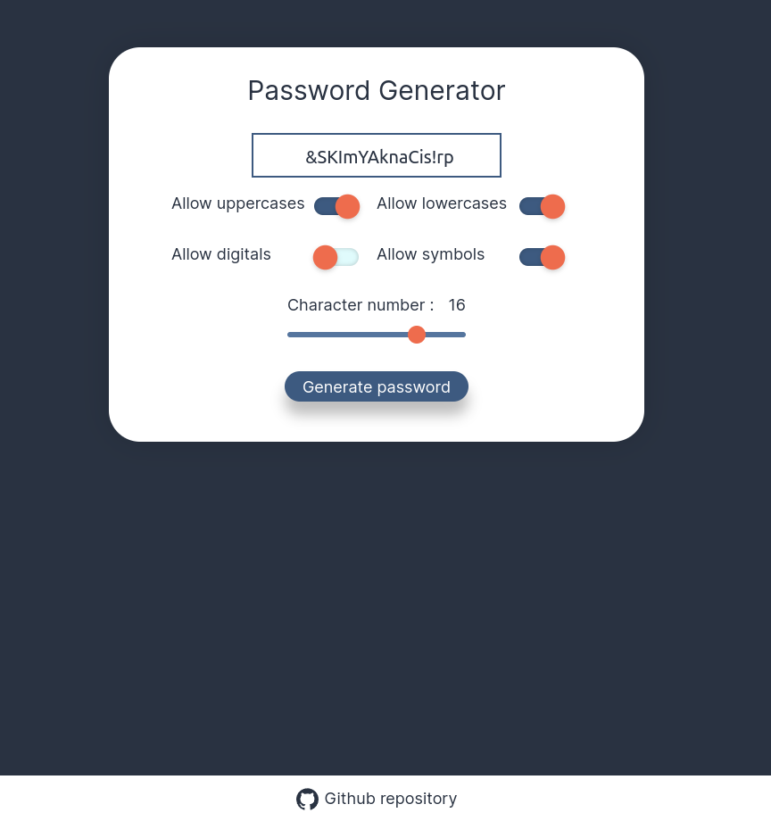

<h1 align="center"> Password Generator </h1>

A web app that generates random passwords with custom rules.

### Tech used :

-   React
-   Typescript
-   UseState Hook
-   Styled Components

### For learning purposes :

This project could be done entirely in the App component but instead I devided the project in small components to learn the useState hook, props and the styled components library.

### The algorithm explained :

I made my own algorithm to generate the password with custom rules and length and it's quite simple:

-   I generate all available characters of each category (uppercase, lowercase, numbers and symbols)
-   I make sure to fill in the password with at least one of each character in a random position of the password
-   To generate the rest of the password, I merge all the available arrays of each chosen category into one large array and randomly draw from this array to finally generate the password with the desired length

The algorithm is in the `components/GenerateButton/passwordGenerator.ts` file and it is self-explanatory and easy to understand

### File structure :

I used the best practices like if I was building a big project. This is why the file structure is too complexe for this small app.

    .
    ├── src/
        ├── components/
            ├── Card/
                ├── index.tsx
                ├── style.ts
            ...
        ├── constants/
        ├── interfaces/
        ├── themes/
        ├── assets/
            ├── font.ttf
            ...
    ...
